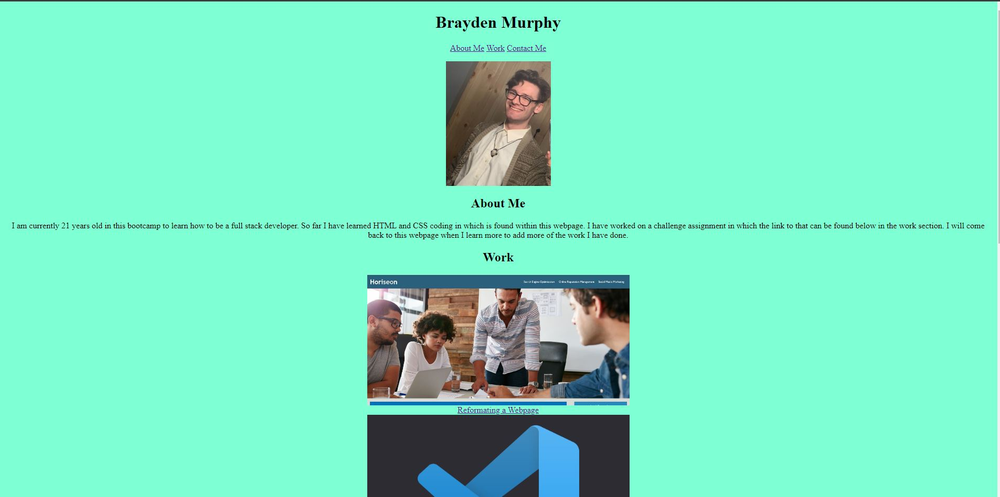

# Coding Portfolio

## Description

I have made a portfolio webpage in which it has a section about me, my work, and a contact section. When each section is clicked in the links at the top of the page it takes you to each of the following sections. When the page is shrinked the text will follow a wrap around the fit in the new page. 

## Acceptance Criteria for the Assignment

```
GIVEN I need to sample a potential employee's previous work
WHEN I load their portfolio
THEN I am presented with the developer's name, a recent photo or avatar, and links to sections about them, their work, and how to contact them
WHEN I click one of the links in the navigation
THEN the UI scrolls to the corresponding section
WHEN I click on the link to the section about their work
THEN the UI scrolls to a section with titled images of the developer's applications
WHEN I am presented with the developer's first application
THEN that application's image should be larger in size than the others
WHEN I click on the images of the applications
THEN I am taken to that deployed application
WHEN I resize the page or view the site on various screens and devices
THEN I am presented with a responsive layout that adapts to my viewport
```

## The Website



## Link to Website

[Link to the Application]()

